  # Social-Network-API

   
  
  ## Table of Contents 

  * [Description](#description)
  
  * [Screenshots](#screenshots)
  
  * [Usage](#usage)
  
  * [Contributing](#contributing)

  * [License](#license)

  * [Questions](#questions)

  ## Description

  Social networks have been such a big industry during this century. From Facebook, Twitter, Instagram and others out there. This application is a backend application working with mongoDB and mongoose to provide a non-relational database structure to a social network application. The database includes users, thoughts, friends, and reactions. The application also handles different routes using chaining to demostrate the different CRUD methods used in the backend.

  ## Screenshots

  Below are screenshots of Insomnia testing the REST APIs. 

  ### All Users
 
  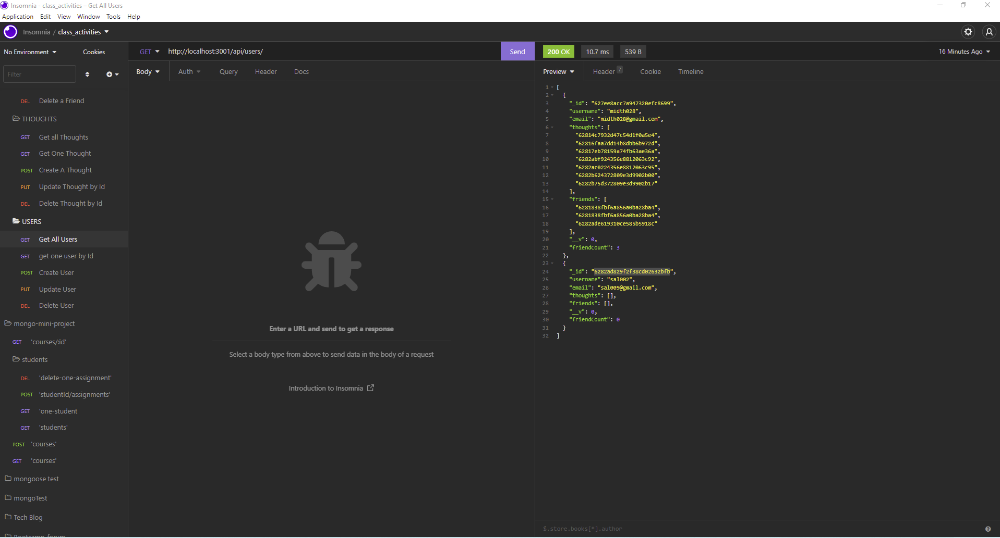

  ### User by Id

  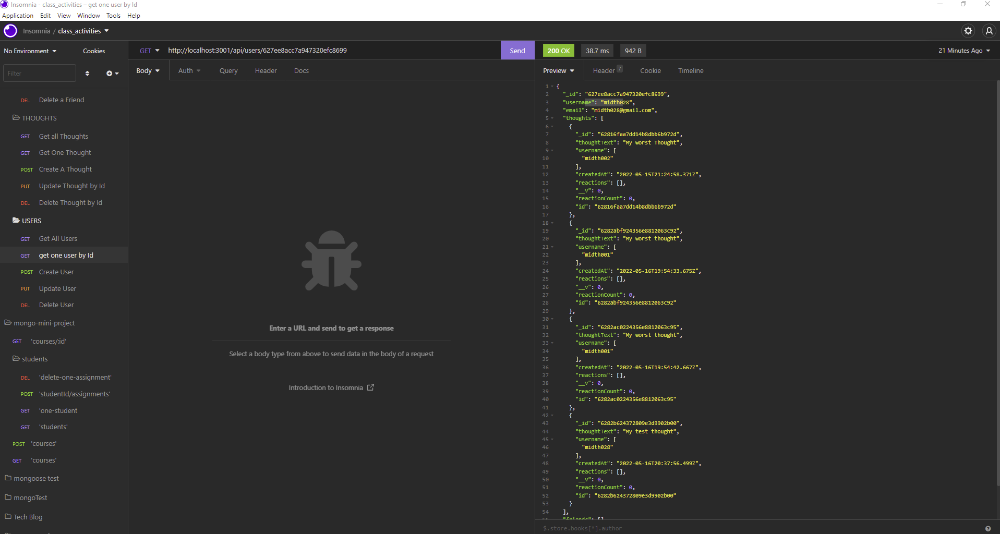

  ### Create User

  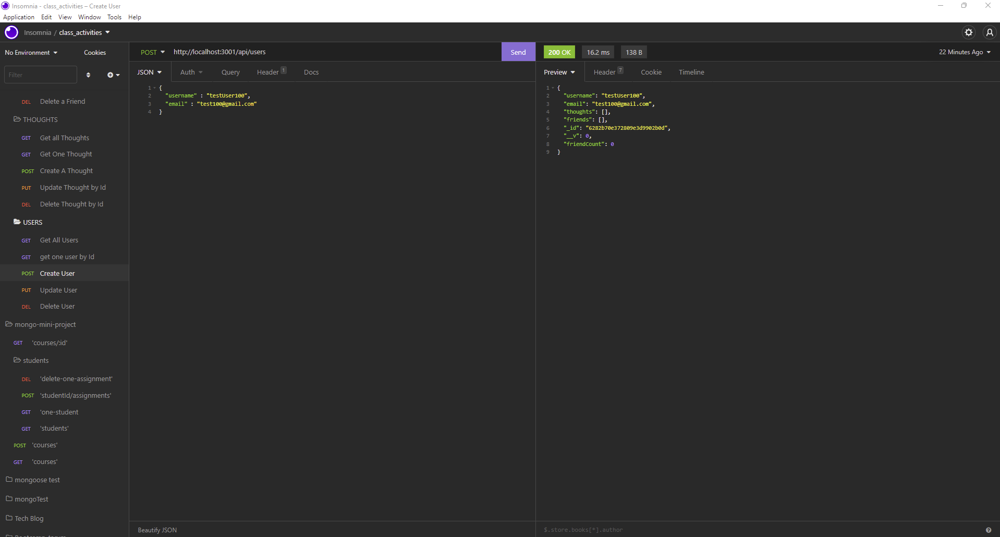

  ### Update User

  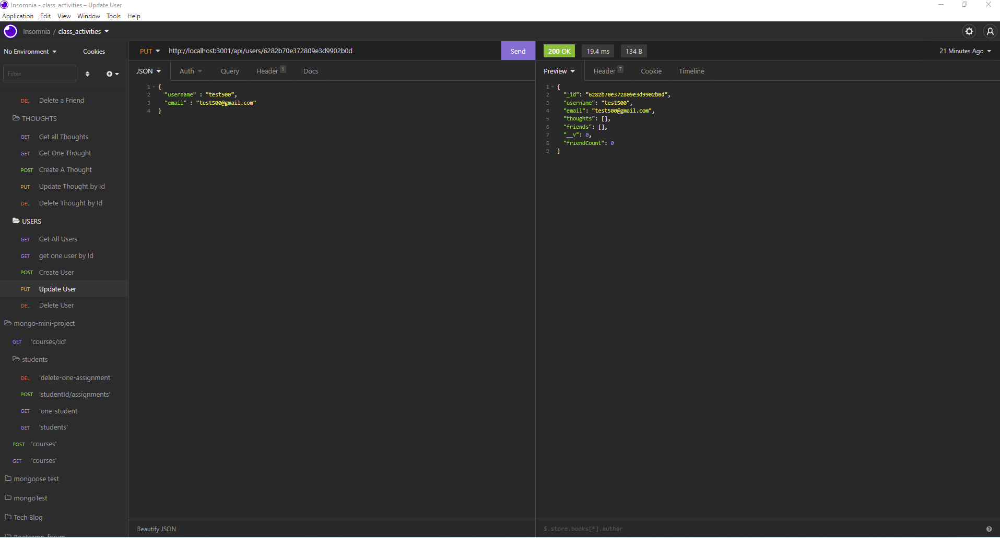

  ### Delete User

  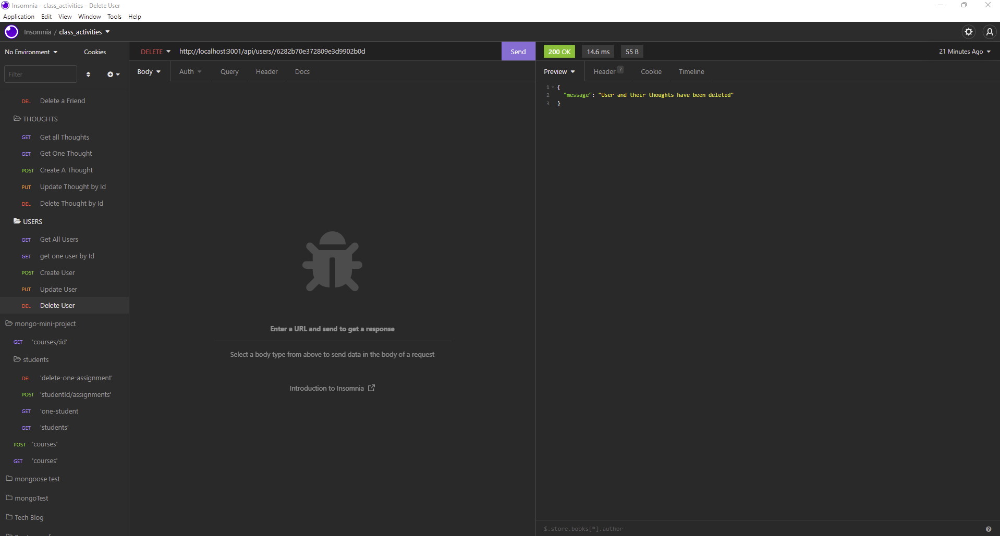

  ### All Thoughts

  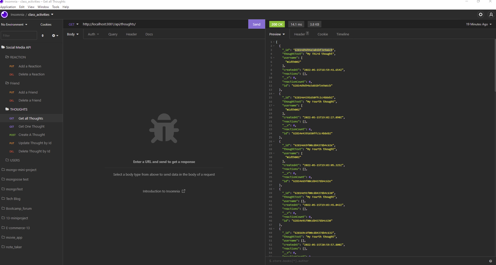

  ### Thought by Id

  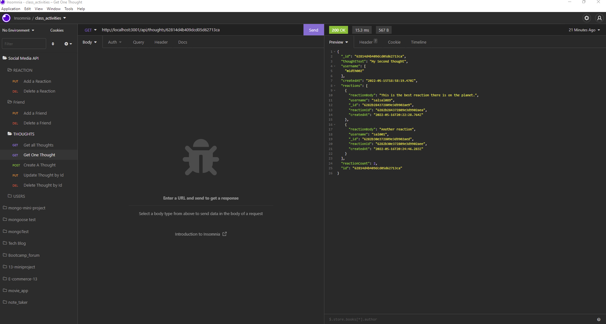

  ### Create Thought 

  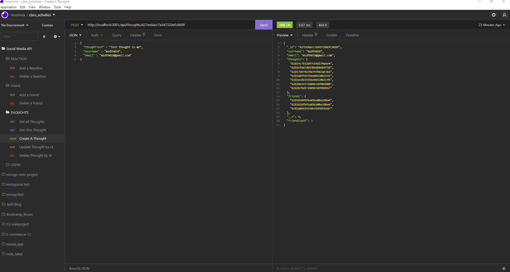

  ### Update Thought 

  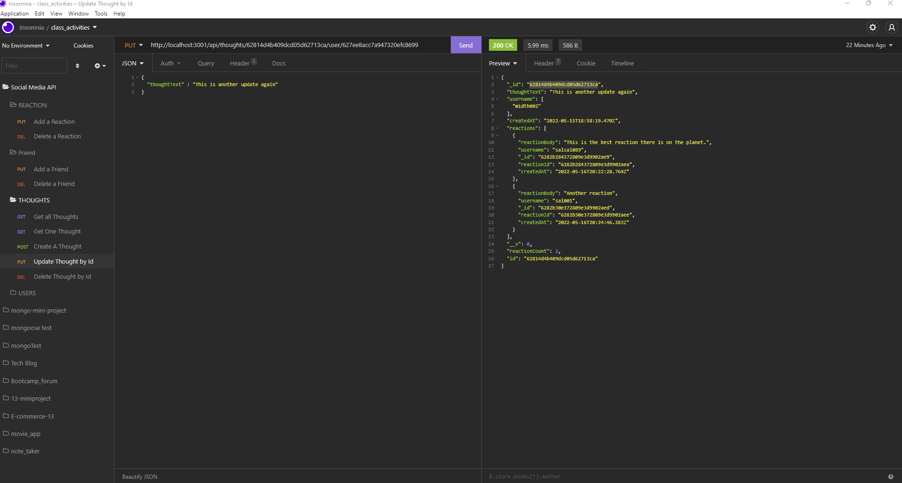

  ### Delete Thought

  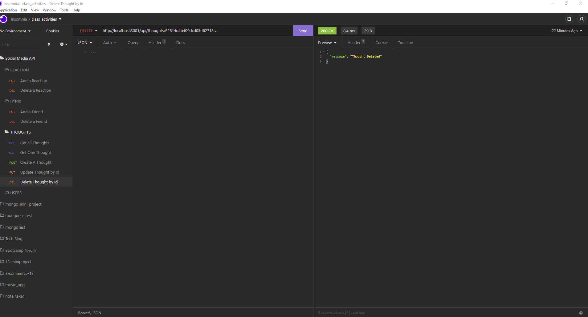

  ### Add Friend

  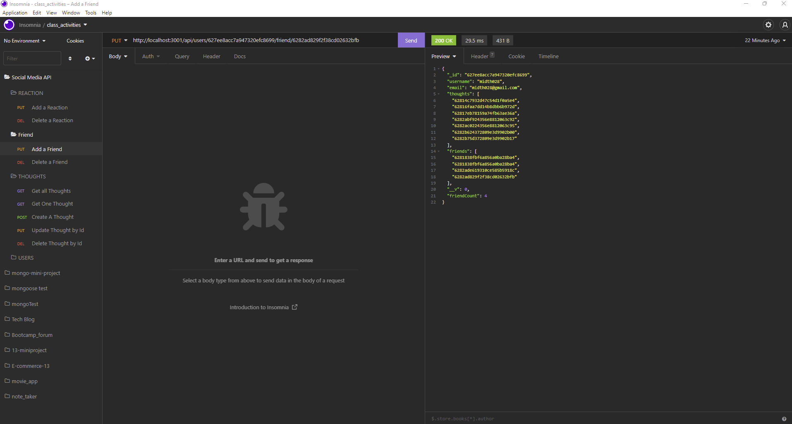

  ### Remove Friend

  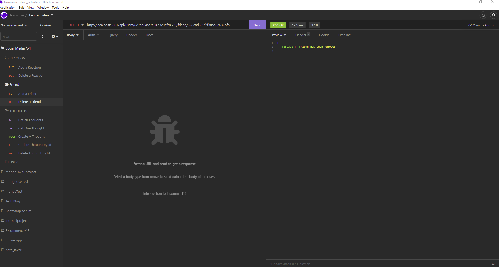

  ### Add Reaction

  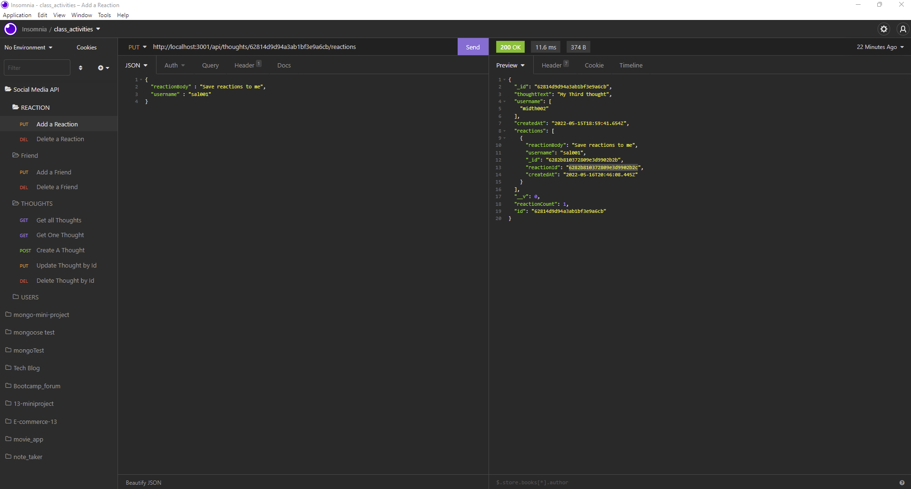

  ### Remove Reaction 

  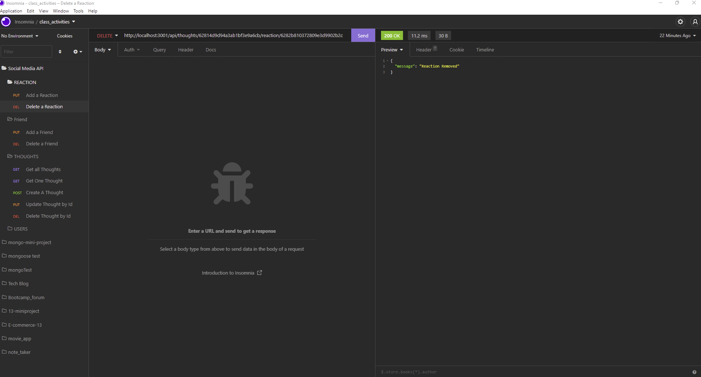
  
  ## Usage

  Users will need to have a mongoDB database like compass or atlas to use this application. Downloading and using mongoose will be necessary for the schemas to work.
  
  ## Contributing

  Contact me via email if you would like to contribute.
  
  ## License

  This project is licensed under the MIT license 

  ## Questions
  
  If you have any questions about the repo, open an issue contact me directly at [midth002@gmail.com](mailto:midth002@gmail.com). You can find more work at [midth002](https://github.com/midth002)
  